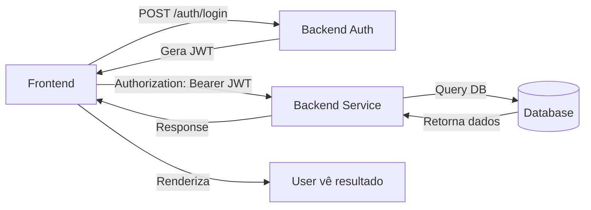

# 📖 Backend & Integração rcgCRM — Handbook

**Data:** Maio 2026  
**Versão:** 1.0 (Offline Completo)  
**Propósito:** Padrões Backend (NestJS), endpoints, integração com Frontend e troubleshooting.

---

## 📑 Índice

1. [Estrutura Backend](#1-estrutura-backend)
2. [Padrão de Serviço Backend](#2-padrão-de-serviço-backend)
3. [Padrão de Controller](#3-padrão-de-controller)
4. [Padrão de Endpoint](#4-padrão-de-endpoint)
5. [Modelo de Dados & Database](#5-modelo-de-dados--database)
6. [Autenticação & JWT](#6-autenticação--jwt)
7. [Paginação & Filtros](#7-paginação--filtros)
8. [Tratamento de Erro Backend](#8-tratamento-de-erro-backend)
9. [Guia: Criar Novo Endpoint](#9-guia-criar-novo-endpoint)
10. [Integração Frontend-Backend](#10-integração-frontend-backend)
11. [Troubleshooting Backend](#11-troubleshooting-backend)
12. [Snippets Backend Prontos](#12-snippets-backend-prontos)

---

## 1. Estrutura Backend

```
backend/
├── src/
│   ├── main.ts                    # Entry point
│   ├── app.module.ts              # Módulo principal
│   ├── modules/
│   │   ├── auth/
│   │   │   ├── auth.controller.ts
│   │   │   ├── auth.service.ts
│   │   │   ├── jwt.strategy.ts
│   │   │   ├── jwt.guard.ts
│   │   │   └── auth.module.ts
│   │   ├── seu-novo-modulo/
│   │   │   ├── seu-novo.controller.ts
│   │   │   ├── seu-novo.service.ts
│   │   │   ├── seu-novo.entity.ts (Database)
│   │   │   ├── seu-novo.dto.ts (Request/Response)
│   │   │   └── seu-novo.module.ts
│   │   └── ...
│   ├── database/
│   │   ├── entities/              # TypeORM entities
│   │   ├── migrations/
│   │   └── config.ts
│   ├── common/
│   │   ├── interceptors/
│   │   ├── filters/
│   │   ├── guards/
│   │   ├── decorators/
│   │   └── pipes/
│   └── config/
│       ├── app.config.ts
│       └── database.config.ts
└── test/
```

---

## 2. Padrão de Serviço Backend

### 2.1 Template Serviço NestJS

**Arquivo:** `backend/src/modules/seu-novo-modulo/seu-novo.service.ts`

```typescript
import { Injectable, NotFoundException, BadRequestException, ConflictException } from '@nestjs/common';
import { InjectRepository } from '@nestjs/typeorm';
import { Repository } from 'typeorm';
import { SeuNovoEntity } from './seu-novo.entity';
import { CreateSeuNovoDto, UpdateSeuNovoDto, ListaSeuNovoDto } from './seu-novo.dto';

@Injectable()
export class SeuNovoService {

  constructor(
    @InjectRepository(SeuNovoEntity)
    private repository: Repository<SeuNovoEntity>
  ) {}

  /**
   * Retorna lista paginada com filtros
   * @param filter Filtros e paginação
   */
  async findAll(filter: ListaSeuNovoDto) {
    const { page = 1, limit = 10, search, status, ordenarPor, ordem } = filter;
    const skip = (page - 1) * limit;

    // Construir query
    let query = this.repository.createQueryBuilder('seu_novo');

    // Filtros
    if (search) {
      query = query.where('seu_novo.nome LIKE :search', { search: `%${search}%` });
    }

    if (status) {
      query = query.andWhere('seu_novo.status = :status', { status });
    }

    // Ordenação
    if (ordenarPor) {
      query = query.orderBy(`seu_novo.${ordenarPor}`, ordem || 'DESC');
    } else {
      query = query.orderBy('seu_novo.dataCriacao', 'DESC');
    }

    // Paginação
    const [items, total] = await query
      .skip(skip)
      .take(limit)
      .getManyAndCount();

    const totalPages = Math.ceil(total / limit);

    return {
      items,
      total,
      page,
      limit,
      totalPages
    };
  }

  /**
   * Retorna um único recurso por ID
   */
  async findOne(id: number): Promise<SeuNovoEntity> {
    const resource = await this.repository.findOne({ where: { id } });

    if (!resource) {
      throw new NotFoundException(`Recurso com ID ${id} não encontrado`);
    }

    return resource;
  }

  /**
   * Cria novo recurso
   */
  async create(dto: CreateSeuNovoDto): Promise<SeuNovoEntity> {
    // Validações customizadas
    const exists = await this.repository.findOne({
      where: { email: dto.email }
    });

    if (exists) {
      throw new ConflictException('Email já cadastrado');
    }

    // Criar entity
    const resource = this.repository.create({
      ...dto,
      status: 'A', // Default
      dataCriacao: new Date()
    });

    return await this.repository.save(resource);
  }

  /**
   * Atualiza recurso existente
   */
  async update(id: number, dto: UpdateSeuNovoDto): Promise<SeuNovoEntity> {
    const resource = await this.findOne(id);

    // Validações
    if (dto.email && dto.email !== resource.email) {
      const exists = await this.repository.findOne({
        where: { email: dto.email }
      });
      if (exists) {
        throw new ConflictException('Email já cadastrado');
      }
    }

    // Atualizar
    Object.assign(resource, {
      ...dto,
      dataAtualizacao: new Date()
    });

    return await this.repository.save(resource);
  }

  /**
   * Deleta recurso
   */
  async delete(id: number): Promise<void> {
    const resource = await this.findOne(id);

    // Validações antes de deletar (ex: pode ter dependências)
    // if (resource.temDependencias) {
    //   throw new BadRequestException('Não pode deletar: tem dependências');
    // }

    await this.repository.delete(id);
  }

  /**
   * Operação customizada
   */
  async executeAction(id: number, action: string): Promise<any> {
    const resource = await this.findOne(id);

    switch (action) {
      case 'ativar':
        resource.status = 'A';
        break;
      case 'desativar':
        resource.status = 'I';
        break;
      default:
        throw new BadRequestException(`Ação ${action} não suportada`);
    }

    return await this.repository.save(resource);
  }
}
```

---

## 3. Padrão de Controller

### 3.1 Template Controller NestJS

**Arquivo:** `backend/src/modules/seu-novo-modulo/seu-novo.controller.ts`

```typescript
import {
  Controller,
  Get,
  Post,
  Put,
  Delete,
  Param,
  Body,
  Query,
  UseGuards,
  HttpCode,
  HttpStatus,
  Request,
  Res,
  Logger
} from '@nestjs/common';
import { Response } from 'express';
import { JwtAuthGuard } from '../../common/guards/jwt-auth.guard';
import { SeuNovoService } from './seu-novo.service';
import { CreateSeuNovoDto, UpdateSeuNovoDto, ListaSeuNovoDto } from './seu-novo.dto';

@Controller('seu-novo-endpoint')
@UseGuards(JwtAuthGuard) // Protege todas as rotas com autenticação
export class SeuNovoController {

  private readonly logger = new Logger(SeuNovoController.name);

  constructor(private readonly service: SeuNovoService) {}

  /**
   * GET /seu-novo-endpoint
   * Retorna lista paginada com filtros
   */
  @Get()
  @HttpCode(HttpStatus.OK)
  async findAll(@Query() filter: ListaSeuNovoDto) {
    this.logger.log(`Listando recursos com filtro: ${JSON.stringify(filter)}`);

    try {
      const result = await this.service.findAll(filter);
      return {
        success: true,
        data: result
      };
    } catch (error) {
      this.logger.error('Erro ao listar:', error);
      throw error;
    }
  }

  /**
   * GET /seu-novo-endpoint/:id
   * Retorna um único recurso
   */
  @Get(':id')
  @HttpCode(HttpStatus.OK)
  async findOne(@Param('id') id: string) {
    this.logger.log(`Carregando recurso com ID: ${id}`);

    const resource = await this.service.findOne(Number(id));
    return {
      success: true,
      data: resource
    };
  }

  /**
   * POST /seu-novo-endpoint
   * Cria novo recurso
   */
  @Post()
  @HttpCode(HttpStatus.CREATED)
  async create(@Body() dto: CreateSeuNovoDto, @Request() req) {
    this.logger.log(`Criando novo recurso: ${JSON.stringify(dto)}`);

    const resource = await this.service.create({
      ...dto,
      usuarioId: req.user.id // Auditoria: quem criou
    });

    return {
      success: true,
      message: 'Recurso criado com sucesso',
      data: resource
    };
  }

  /**
   * PUT /seu-novo-endpoint/:id
   * Atualiza recurso existente
   */
  @Put(':id')
  @HttpCode(HttpStatus.OK)
  async update(
    @Param('id') id: string,
    @Body() dto: UpdateSeuNovoDto,
    @Request() req
  ) {
    this.logger.log(`Atualizando recurso ${id}: ${JSON.stringify(dto)}`);

    const resource = await this.service.update(Number(id), {
      ...dto,
      usuarioAtualizadorId: req.user.id // Auditoria: quem atualizou
    });

    return {
      success: true,
      message: 'Recurso atualizado com sucesso',
      data: resource
    };
  }

  /**
   * DELETE /seu-novo-endpoint/:id
   * Deleta recurso
   */
  @Delete(':id')
  @HttpCode(HttpStatus.NO_CONTENT)
  async delete(@Param('id') id: string, @Request() req) {
    this.logger.log(`Deletando recurso ${id}`);

    await this.service.delete(Number(id));

    return {
      success: true,
      message: 'Recurso deletado com sucesso'
    };
  }

  /**
   * POST /seu-novo-endpoint/:id/:action
   * Executa ação customizada (ex: ativar, desativar)
   */
  @Post(':id/:action')
  @HttpCode(HttpStatus.OK)
  async executeAction(
    @Param('id') id: string,
    @Param('action') action: string
  ) {
    this.logger.log(`Executando ação ${action} no recurso ${id}`);

    const result = await this.service.executeAction(Number(id), action);

    return {
      success: true,
      message: `Ação ${action} executada com sucesso`,
      data: result
    };
  }
}
```

---

## 4. Padrão de Endpoint

### 4.1 REST Endpoints Documentados

| Método | Endpoint | Descrição | Query Params |
|--------|----------|-----------|--------------|
| **GET** | `/seu-novo-endpoint` | Lista com filtros | `page`, `limit`, `search`, `status`, `ordenarPor`, `ordem` |
| **GET** | `/seu-novo-endpoint/:id` | Detalhe | - |
| **POST** | `/seu-novo-endpoint` | Criar | - |
| **PUT** | `/seu-novo-endpoint/:id` | Atualizar | - |
| **DELETE** | `/seu-novo-endpoint/:id` | Deletar | - |
| **POST** | `/seu-novo-endpoint/:id/ativar` | Ativar | - |
| **POST** | `/seu-novo-endpoint/:id/desativar` | Desativar | - |

### 4.2 Response Pattern

```json
// Sucesso (200)
{
  "success": true,
  "message": "Operação realizada com sucesso",
  "data": { /* objeto */ }
}

// Sucesso com paginação (200)
{
  "success": true,
  "data": {
    "items": [{ /* objeto */ }],
    "total": 100,
    "page": 1,
    "limit": 10,
    "totalPages": 10
  }
}

// Erro (400, 401, 403, 404, 500)
{
  "success": false,
  "message": "Descrição do erro",
  "error": "Código do erro (ex: CONFLICT, NOT_FOUND)"
}
```

---

## 5. Modelo de Dados & Database

### 5.1 Entity (TypeORM)

**Arquivo:** `backend/src/modules/seu-novo-modulo/seu-novo.entity.ts`

```typescript
import { Entity, PrimaryGeneratedColumn, Column, CreateDateColumn, UpdateDateColumn, Index } from 'typeorm';

@Entity('seu_novo')
@Index(['email'], { unique: true })
@Index(['status'])
export class SeuNovoEntity {

  @PrimaryGeneratedColumn()
  id: number;

  @Column({ type: 'varchar', length: 255, nullable: false })
  nome: string;

  @Column({ type: 'varchar', length: 255, nullable: true })
  email: string;

  @Column({ type: 'enum', enum: ['A', 'I'], default: 'A' })
  status: 'A' | 'I';

  @CreateDateColumn({ type: 'timestamp', default: () => 'CURRENT_TIMESTAMP' })
  dataCriacao: Date;

  @UpdateDateColumn({ type: 'timestamp', nullable: true })
  dataAtualizacao: Date;

  @Column({ type: 'int', nullable: true })
  usuarioId: number;

  @Column({ type: 'int', nullable: true })
  usuarioAtualizadorId: number;
}
```

### 5.2 DTO (Request/Response)

**Arquivo:** `backend/src/modules/seu-novo-modulo/seu-novo.dto.ts`

```typescript
import { IsString, IsEmail, IsOptional, IsEnum, IsNumber, Min, Max } from 'class-validator';

/**
 * DTO para criar novo recurso
 */
export class CreateSeuNovoDto {
  @IsString()
  nome: string;

  @IsOptional()
  @IsEmail()
  email?: string;

  @IsOptional()
  @IsEnum(['A', 'I'])
  status?: 'A' | 'I';
}

/**
 * DTO para atualizar recurso
 */
export class UpdateSeuNovoDto {
  @IsOptional()
  @IsString()
  nome?: string;

  @IsOptional()
  @IsEmail()
  email?: string;

  @IsOptional()
  @IsEnum(['A', 'I'])
  status?: 'A' | 'I';
}

/**
 * DTO para listagem com filtros
 */
export class ListaSeuNovoDto {
  @IsOptional()
  @IsNumber()
  @Min(1)
  page?: number = 1;

  @IsOptional()
  @IsNumber()
  @Min(1)
  @Max(100)
  limit?: number = 10;

  @IsOptional()
  @IsString()
  search?: string;

  @IsOptional()
  @IsEnum(['A', 'I'])
  status?: 'A' | 'I';

  @IsOptional()
  @IsString()
  ordenarPor?: string = 'dataCriacao';

  @IsOptional()
  @IsEnum(['ASC', 'DESC'])
  ordem?: 'ASC' | 'DESC' = 'DESC';
}
```

---

## 6. Autenticação & JWT

### 6.1 JWT Strategy

**Arquivo:** `backend/src/modules/auth/jwt.strategy.ts`

```typescript
import { Injectable } from '@nestjs/common';
import { PassportStrategy } from '@nestjs/passport';
import { ExtractJwt, Strategy } from 'passport-jwt';
import { AuthService } from './auth.service';

@Injectable()
export class JwtStrategy extends PassportStrategy(Strategy) {
  constructor(private authService: AuthService) {
    super({
      jwtFromRequest: ExtractJwt.fromAuthHeaderAsBearerToken(),
      ignoreExpiration: false,
      secretOrKey: process.env.JWT_SECRET || 'your-secret-key'
    });
  }

  async validate(payload: any) {
    // 'payload' contém { sub: userId, iat, exp }
    const user = await this.authService.findUserById(payload.sub);

    if (!user) {
      throw new UnauthorizedException('Usuário não encontrado');
    }

    return user; // Disponível em req.user
  }
}
```

### 6.2 JWT Guard

**Arquivo:** `backend/src/common/guards/jwt-auth.guard.ts`

```typescript
import { Injectable, UnauthorizedException } from '@nestjs/common';
import { AuthGuard } from '@nestjs/passport';

@Injectable()
export class JwtAuthGuard extends AuthGuard('jwt') {
  handleRequest(err, user, info) {
    if (err || !user) {
      if (info?.name === 'TokenExpiredError') {
        throw new UnauthorizedException('Token expirado');
      }
      throw err || new UnauthorizedException('Token inválido');
    }
    return user;
  }
}
```

### 6.3 Login Controller

```typescript
@Controller('auth')
export class AuthController {

  constructor(private authService: AuthService) {}

  @Post('login')
  async login(@Body() credentials: { username: string; password: string }) {
    const user = await this.authService.validateUser(
      credentials.username,
      credentials.password
    );

    if (!user) {
      throw new UnauthorizedException('Credenciais inválidas');
    }

    const accessToken = this.authService.generateToken(user);

    return {
      success: true,
      accessToken,
      user: {
        id: user.id,
        username: user.username,
        email: user.email,
        perfil: user.perfil
      }
    };
  }
}
```

---

## 7. Paginação & Filtros

### 7.1 Query Builder com Filtros

```typescript
async findAll(filter: ListaSeuNovoDto) {
  const { page = 1, limit = 10, search, status, ordenarPor, ordem } = filter;
  const skip = (page - 1) * limit;

  let query = this.repository.createQueryBuilder('seu_novo');

  // Filtros
  if (search) {
    query = query.where(
      'seu_novo.nome LIKE :search OR seu_novo.email LIKE :search',
      { search: `%${search}%` }
    );
  }

  if (status) {
    query = query.andWhere('seu_novo.status = :status', { status });
  }

  // Ordenação
  const validColumns = ['nome', 'email', 'dataCriacao', 'status'];
  if (ordenarPor && validColumns.includes(ordenarPor)) {
    query = query.orderBy(`seu_novo.${ordenarPor}`, ordem || 'DESC');
  }

  // Paginação
  const [items, total] = await query
    .skip(skip)
    .take(limit)
    .getManyAndCount();

  return {
    items,
    total,
    page,
    limit,
    totalPages: Math.ceil(total / limit)
  };
}
```

### 7.2 Validação de Parâmetros

```typescript
import { BadRequestException } from '@nestjs/common';

export function validatePaginationParams(page: number, limit: number) {
  if (page < 1) {
    throw new BadRequestException('Page deve ser >= 1');
  }
  if (limit < 1 || limit > 100) {
    throw new BadRequestException('Limit deve estar entre 1 e 100');
  }
}
```

---

## 8. Tratamento de Erro Backend

### 8.1 Global Exception Filter

**Arquivo:** `backend/src/common/filters/http-exception.filter.ts`

```typescript
import {
  ExceptionFilter,
  Catch,
  ArgumentsHost,
  HttpException,
  HttpStatus,
  Logger
} from '@nestjs/common';
import { Response } from 'express';

@Catch()
export class AllExceptionsFilter implements ExceptionFilter {
  private readonly logger = new Logger(AllExceptionsFilter.name);

  catch(exception: unknown, host: ArgumentsHost) {
    const ctx = host.switchToHttp();
    const response = ctx.getResponse<Response>();

    let status = HttpStatus.INTERNAL_SERVER_ERROR;
    let message = 'Erro interno do servidor';
    let error = 'INTERNAL_SERVER_ERROR';

    if (exception instanceof HttpException) {
      status = exception.getStatus();
      const response = exception.getResponse() as any;
      message = response.message || exception.message;
      error = response.error;
    } else if (exception instanceof Error) {
      message = exception.message;
      this.logger.error(exception.stack);
    }

    this.logger.error(`[${status}] ${message}`);

    response.status(status).json({
      success: false,
      statusCode: status,
      message,
      error,
      timestamp: new Date().toISOString()
    });
  }
}
```

**Registrar em main.ts:**
```typescript
app.useGlobalFilters(new AllExceptionsFilter());
```

### 8.2 Erros Customizados

```typescript
// Não encontrado
throw new NotFoundException('Recurso não encontrado');

// Conflito (ex: email duplicado)
throw new ConflictException('Email já cadastrado');

// Requisição inválida
throw new BadRequestException('Dados inválidos');

// Não autorizado
throw new UnauthorizedException('Token inválido');

// Proibido
throw new ForbiddenException('Você não tem permissão');

// Erro interno
throw new InternalServerErrorException('Erro no servidor');
```

---

## 9. Guia: Criar Novo Endpoint

### 9.1 Passo a Passo (15 minutos)

#### Passo 1: Criar Entity
```typescript
// backend/src/modules/seu-novo/seu-novo.entity.ts
@Entity('seu_novo')
export class SeuNovoEntity {
  @PrimaryGeneratedColumn()
  id: number;

  @Column({ type: 'varchar', length: 255 })
  nome: string;

  // Adicione outros campos...
}
```

#### Passo 2: Criar DTO
```typescript
// backend/src/modules/seu-novo/seu-novo.dto.ts
export class CreateSeuNovoDto {
  nome: string;
}

export class ListaSeuNovoDto {
  page?: number;
  limit?: number;
  search?: string;
}
```

#### Passo 3: Criar Service
```typescript
// backend/src/modules/seu-novo/seu-novo.service.ts
// Copiar template da seção 2.1, ajustar Entity e DTO
```

#### Passo 4: Criar Controller
```typescript
// backend/src/modules/seu-novo/seu-novo.controller.ts
// Copiar template da seção 3.1, ajustar rotas
```

#### Passo 5: Criar Module
```typescript
// backend/src/modules/seu-novo/seu-novo.module.ts
import { Module } from '@nestjs/common';
import { TypeOrmModule } from '@nestjs/typeorm';
import { SeuNovoEntity } from './seu-novo.entity';
import { SeuNovoService } from './seu-novo.service';
import { SeuNovoController } from './seu-novo.controller';

@Module({
  imports: [TypeOrmModule.forFeature([SeuNovoEntity])],
  providers: [SeuNovoService],
  controllers: [SeuNovoController],
  exports: [SeuNovoService]
})
export class SeuNovoModule {}
```

#### Passo 6: Importar Module
```typescript
// backend/src/app.module.ts
import { SeuNovoModule } from './modules/seu-novo/seu-novo.module';

@Module({
  imports: [
    // ... outros modules
    SeuNovoModule
  ]
})
export class AppModule {}
```

#### Passo 7: Testar com Postman/Insomnia
```
POST http://localhost:3000/seu-novo-endpoint
Headers: Authorization: Bearer <token>
Body: { "nome": "Teste" }
```

---

## 10. Integração Frontend-Backend

### 10.1 Fluxo Completo



### 10.2 Exemplo Prático: Login & Dashboard

**Frontend Login:**
```typescript
// frontend/services/auth.ts
login(credentials: any): Observable<AuthResponse> {
  return this.http.post<AuthResponse>(`${this.API_URL}/auth/login`, credentials);
}
```

**Backend Login:**
```typescript
// backend/auth.controller.ts
@Post('login')
async login(@Body() credentials: any) {
  const user = await this.authService.validateUser(credentials.username, credentials.password);
  const accessToken = this.authService.generateToken(user);
  return { success: true, accessToken, user };
}
```

**Frontend Dashboard:**
```typescript
// frontend/pages/dashboard.ts
this.analyticsService.getDashboardData(year, month).subscribe(res => {
  this.categorySeries = res.categories;
});
```

**Backend Dashboard:**
```typescript
// backend/analytics.controller.ts
@Get('dashboard')
async getDashboardData(@Query('year') year: number, @Query('month') month: number) {
  const result = await this.analyticsService.getDashboardData(year, month);
  return { success: true, data: result };
}
```

---

## 11. Troubleshooting Backend

| Problema | Causa | Solução |
|----------|-------|---------|
| **401 Unauthorized** | Token inválido/expirado | Gerar novo token, verificar JWT_SECRET |
| **Cannot find module** | Import path errado | Verificar path relativo, executar `npm install` |
| **Database connection failed** | Conexão com BD não iniciada | Verificar credentials em `.env`, conectar com `docker-compose up` |
| **CORS error** | Frontend e Backend em portas diferentes | Adicionar CORS: `app.enableCors()` |
| **Entity not saved** | Falta @Entity ou não declarada em TypeOrmModule | Verificar Entity decorator e importação no Module |
| **Query timeout** | Query muito pesada | Adicionar índices (`@Index`), paginar resultados |
| **Validation error** | DTO não validado | Importar `ValidationPipe` em main.ts |
| **Method not allowed** | Rota não mapeada corretamente | Verificar `@Get`, `@Post`, etc. e path |
| **Data not updated** | SavedEntity não retornado corretamente | Fazer `entity = await repo.save(entity)` |
| **Memory leak** | Conexões BD não fechadas | Usar `OnModuleDestroy`, fechar conexões |

**Debug Checklist:**
```bash
# 1. Verificar logs
docker logs seu_backend_container

# 2. Verificar database
psql -U user -d database -c "SELECT * FROM seu_novo;"

# 3. Testar endpoint com curl
curl -H "Authorization: Bearer $TOKEN" http://localhost:3000/seu-novo-endpoint

# 4. Verificar se módulo está importado em app.module.ts
grep -r "SeuNovoModule" src/app.module.ts

# 5. Verificar se controller é @UseGuards(JwtAuthGuard)
grep -A2 "@Controller" src/modules/seu-novo/seu-novo.controller.ts

# 6. Verificar entity é @Entity
grep "@Entity" src/modules/seu-novo/seu-novo.entity.ts
```

---

## 12. Snippets Backend Prontos

### 12.1 Snippet: Auditoria (quem criou/atualizou)

```typescript
// no service
async create(dto: CreateDto, userId: number) {
  return this.repository.save({
    ...dto,
    usuarioId: userId,
    dataCriacao: new Date()
  });
}

async update(id: number, dto: UpdateDto, userId: number) {
  const entity = await this.findOne(id);
  Object.assign(entity, {
    ...dto,
    usuarioAtualizadorId: userId,
    dataAtualizacao: new Date()
  });
  return this.repository.save(entity);
}

// no controller
@Put(':id')
async update(@Param('id') id: string, @Body() dto: UpdateDto, @Request() req) {
  return this.service.update(Number(id), dto, req.user.id);
}
```

### 12.2 Snippet: Soft Delete

```typescript
// entity
@Column({ type: 'timestamp', nullable: true })
dataDeletacao: Date;

@Column({ type: 'boolean', default: false })
deletado: boolean;

// service - delete
async delete(id: number) {
  return this.repository.update(id, {
    deletado: true,
    dataDeletacao: new Date()
  });
}

// service - findAll (excluir deletados)
async findAll(filter: any) {
  let query = this.repository.createQueryBuilder('entity')
    .where('entity.deletado = :deletado', { deletado: false });
  // ... resto da query
}
```

### 12.3 Snippet: Validação Email Customizada

```typescript
import { registerDecorator, ValidationOptions, ValidatorConstraint } from 'class-validator';
import { Injectable } from '@nestjs/common';

@ValidatorConstraint({ name: 'IsEmailUnique', async: true })
@Injectable()
export class IsEmailUniqueConstraint {
  constructor(private repository: SeuNovoRepository) {}

  async validate(email: string): Promise<boolean> {
    const exists = await this.repository.findOne({ where: { email } });
    return !exists; // True = válido (não existe)
  }

  defaultMessage(): string {
    return 'Email já cadastrado';
  }
}

// Usar no DTO
export class CreateSeuNovoDto {
  @IsEmail()
  @Validate(IsEmailUniqueConstraint)
  email: string;
}
```

### 12.4 Snippet: Operação em Lote

```typescript
// service
async importarEmLote(items: CreateSeuNovoDto[]): Promise<any> {
  const savedItems = [];
  
  for (const item of items) {
    try {
      const saved = await this.repository.save(item);
      savedItems.push({ success: true, data: saved });
    } catch (error) {
      savedItems.push({ success: false, error: error.message, item });
    }
  }

  return {
    total: items.length,
    sucesso: savedItems.filter(s => s.success).length,
    erro: savedItems.filter(s => !s.success).length,
    resultados: savedItems
  };
}

// controller
@Post('importar-lote')
async importarLote(@Body() items: CreateSeuNovoDto[]) {
  return this.service.importarEmLote(items);
}
```

### 12.5 Snippet: Rate Limiting

```typescript
import { ThrottlerModule, ThrottlerGuard } from '@nestjs/throttler';

// app.module.ts
@Module({
  imports: [
    ThrottlerModule.forRoot({
      ttl: 60,      // 60 segundos
      limit: 10     // máx 10 requisições
    })
  ]
})
export class AppModule {}

// controller
@UseGuards(ThrottlerGuard)
@Get()
async findAll() {
  // Máx 10 requisições por minuto
}
```

---

## 🎯 Checklist: Novo Endpoint Completo

### Backend
- [ ] Entity criada com decorators
- [ ] DTO criado com validação
- [ ] Service implementado (findAll, findOne, create, update, delete)
- [ ] Controller implementado com JwtAuthGuard
- [ ] Module criado e importado em app.module.ts
- [ ] Testado com Postman/Insomnia
- [ ] Logs adicionados (Logger)
- [ ] Tratamento de erro apropriado

### Frontend
- [ ] Modelo criado (interface)
- [ ] Serviço criado (CRUD)
- [ ] Componente criado (standalone)
- [ ] Template criado (filtros, tabela, modal)
- [ ] Rota registrada em app.routes.ts
- [ ] Interceptador funciona (Bearer Token)
- [ ] Testado no navegador
- [ ] Sem console.errors

### Integração
- [ ] Backend responde na porta certa
- [ ] Frontend consegue fazer requisição
- [ ] CORS configurado (se necessário)
- [ ] Token JWT funciona end-to-end
- [ ] Paginação funciona
- [ ] Filtros funcionam
- [ ] Create/Update/Delete funcionam

---

**Gerado:** Maio 2026  
**Status:** ✅ Offline Completo — Pronto para implementação com humano ou IA
