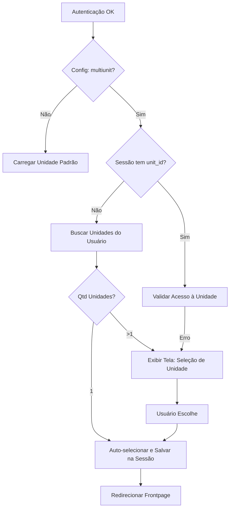
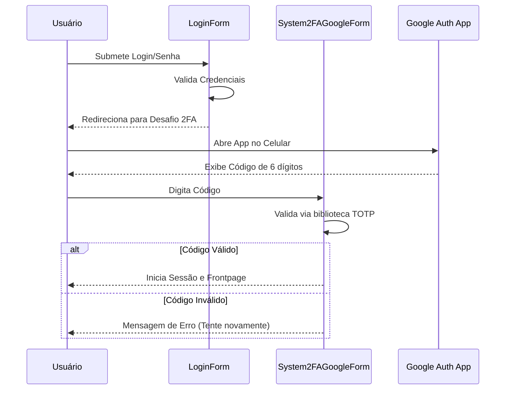

# Admin — Fluxos Detalhados

Este documento detalha as interações e decisões em fluxos complexos da unit Admin.

## 1. Fluxo de Decisão de Unidade (Multi-unit)

Este fluxo ocorre após a validação de login e antes do carregamento do Dashboard.

## 2. Fluxo de Desafio 2FA (Google Authenticator)

## 3. Fluxo de Aceite de Termos e Privacidade

Ocorre apenas se `accepted_term_policy == 'N'`.

1. **Intercepção:** Após o login, se a flag estiver negativa, o sistema redireciona para `SystemTermsService`.
2. **Visualização:** O sistema carrega o texto dos termos (armazenado em `system_preference` ou arquivo local).
3. **Ação:** O usuário clica em "Aceito e Desejo Continuar".
4. **Persistência:** 
    - Atualiza `system_users.accepted_term_policy = 'Y'`.
    - Grava `accepted_term_policy_at = NOW()`.
    - Registra log de IP do aceite. 🟢
5. **Liberação:** Segue para o fluxo de Multi-unidade ou Frontpage.
