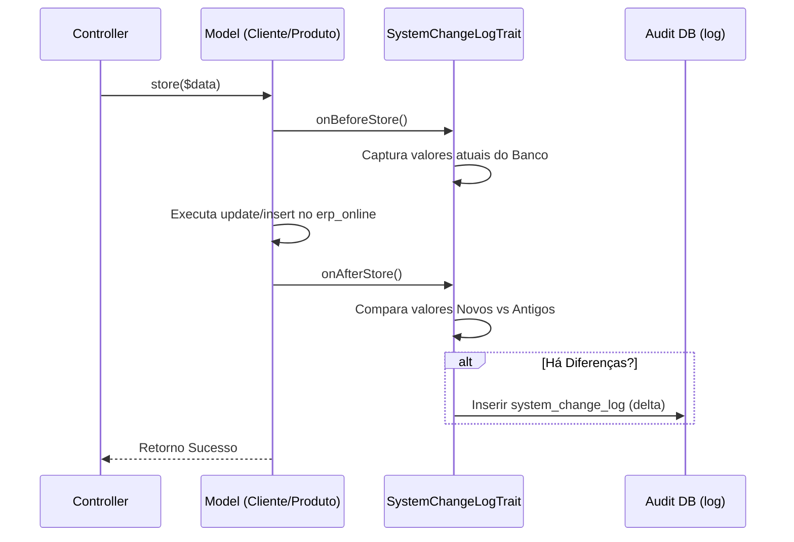

# Cadastros — Fluxos Detalhados

Detalhamento dos fluxos de manutenção de dados mestre.

## 1. Fluxo de Auditoria Transparente (Change Log)

Este fluxo é acionado em todo salvamento de entidades que utilizam a `SystemChangeLogTrait`.

## 2. Fluxo de Saneamento de Dados (AtualizaCliente)

Processo de workflow para atualização de cadastros por terceiros (vendedores).

1. **Solicitação:** O vendedor abre o formulário `AtualizaCliente`.
2. **Entrada:** Ele preenche apenas os campos que mudaram (ou todos).
3. **Persistência Temporária:** Os dados são salvos na tabela `cliente_atualizacao` com status 'Pendente'. 🟢
4. **Análise:** Um usuário Admin revisa as solicitações via `ClienteAtualizacaoSimpleList`.
5. **Efetivação:** Ao aprovar, o sistema copia os dados de `cliente_atualizacao` para a tabela mestre `cliente`. 🟡
6. **Finalização:** A solicitação é marcada como 'Processada'.

## 3. Hierarquia de Categorias

1. O sistema permite cadastrar `Categoria` (nível 1).
2. Cada categoria pode ter múltiplas `SubCategoria` (nível 2).
3. O `Produto` é vinculado obrigatoriamente a uma `SubCategoria`, herdando a `Categoria` pai para fins de relatórios de metas. 🟢
