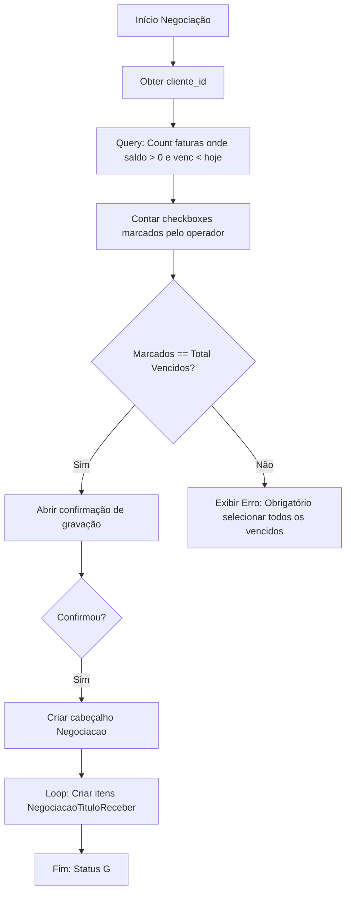

# Cobrança — Fluxos Detalhados

Mapeamento dos processos de recuperação de crédito.

## 1. Fluxo de Validação de Cobrança Total

Regra de ouro identificada no código: "Ou negocia tudo o que está vencido, ou não negocia nada".

## 2. Fluxo de Identificação Visual de Atraso

Aplicado via PHP nos transformadores de coluna do DataGrid.

1. **Dado** um registro da `ViewTituloCliente`.
2. **Se** `saldo > 0` E `vencimento < curdate()`:
    - Aplica cor de texto Vermelho.
    - Aplica cor de fundo de linha Amarelo suave (`#FFF9A7`).
3. **Senão se** `saldo > 0`:
    - Mantém texto padrão.
    - Mantém fundo branco.
4. **Senão** (saldo 0):
    - Colore de Cinza ou oculta conforme filtro de "Somente Abertos". 🟢

## 3. Fluxo de Consulta de Maior Atraso

1. O sistema utiliza a subquery SQL `DATEDIFF(CURDATE(), min(venc_real))` na view `view_cliente_saldo_titulo`.
2. Isso garante que, em qualquer tela de resumo, o supervisor saiba imediatamente que o cliente X tem faturas atrasadas há "X dias" (baseado na fatura mais antiga). 🟢
