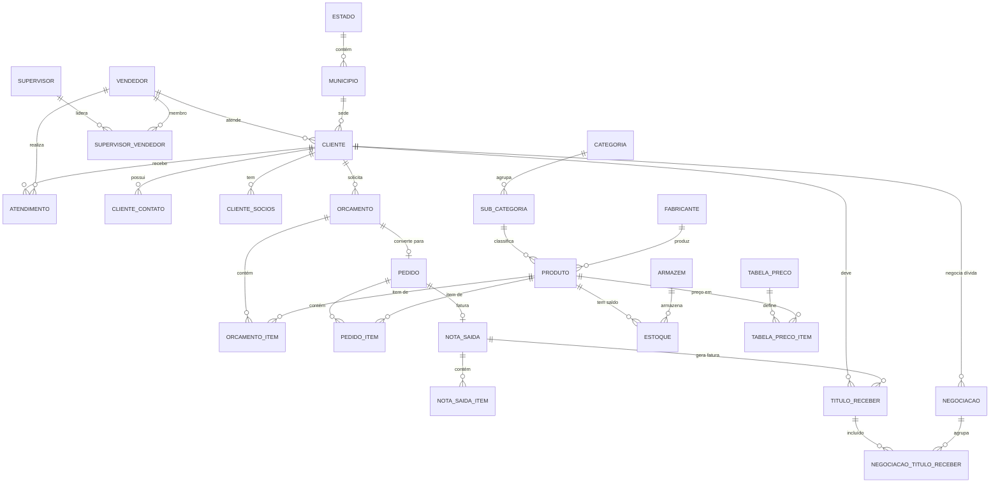

# ERD — rcg (ERP Online)

Mapeamento completo dos relacionamentos do banco de dados `erp_online`.

## Resumo Estrutural
- **Total de Tabelas:** ~60 físicas + ~30 views.
- **Banco Principal:** PostgreSQL (conforme DDL fornecido).
- **Padronização:** Chaves primárias via `SERIAL` (integers auto-incremento), auditoria via campos `dt_inclusao` e `dt_alteracao` em quase todas as tabelas.
