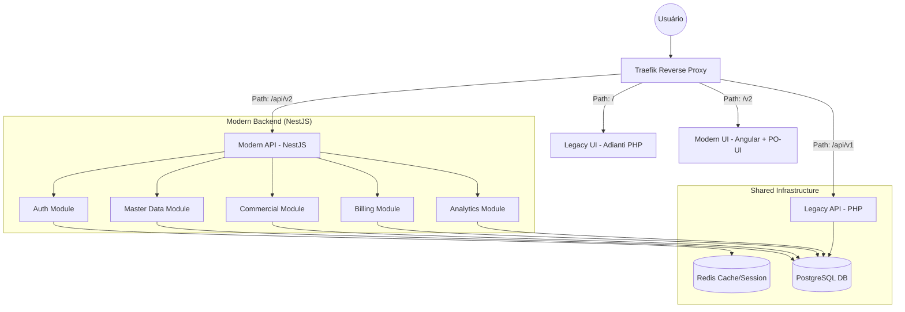

# Target Architecture — Reversa

Este documento descreve a arquitetura alvo para o sistema Reversa, fundamentada no paradigma **Híbrido (Equilibrado)** e na estratégia **Strangler Fig**.

## 1. Visão Geral da Infraestrutura

A infraestrutura utiliza Docker para orquestração, com o Traefik atuando como o roteador inteligente que permite a coexistência entre o legado (PHP) e o novo (NestJS/Angular).

## 2. Padrões por Módulo

Conforme definido na decisão de topologia, os módulos seguem padrões distintos de implementação para equilibrar modernização e velocidade de entrega (paridade).

| Módulo | Estratégia | Padrão Arquitetural | Tecnologias Chave |
| :--- | :--- | :--- | :--- |
| **Auth** | Modernizar | Clean Architecture + JWT | Passport, Redis, Bcrypt |
| **Master Data** | Preservar | Active Record (Anemic Model) | TypeORM BaseEntity |
| **Commercial** | Modernizar | DDD + Service Layer | RxJS, Domain Services |
| **Billing** | Híbrido | Transaction Script / Domain Model | TypeORM Repository |
| **Analytics** | Modernizar | CQRS (Read Models) | Redis, Materialized Views |

## 3. Comunicação Inter-Módulos

1. **Síncrona**: Chamadas de serviço internas via Injeção de Dependência (DI) do NestJS.
2. **Assíncrona**: Eventos de domínio locais (EventEmitter2) para desacoplamento de efeitos colaterais (ex: auditoria, notificações).
3. **Estado Compartilhado**: O Redis atua como ponte de estado entre o legado e o novo para sessões e cache de permissões.

## 4. Camadas do Backend (NestJS)

- **Controller**: Trata requisições HTTP e valida inputs (DTOs).
- **Service/UseCase**: Contém a lógica de negócio. Módulos modernizados usam UseCases puros; módulos preservados usam Services que manipulam Entities diretamente.
- **Entity**:
    - **Modernizado**: Entidades ricas com validação interna.
    - **Preservado**: `BaseEntity` do TypeORM para operações rápidas de CRUD.
- **Repository**: Interface de acesso a dados (abstraída nos módulos modernizados).

## 5. Camadas do Frontend (Angular)

- **Pages**: Componentes de rota que orquestram a visualização.
- **UI Components**: Componentes PO-UI e customizados reutilizáveis.
- **Services**: Comunicação com a API v2.
- **Guards**: Proteção de rotas baseada no JWT/RBAC.
