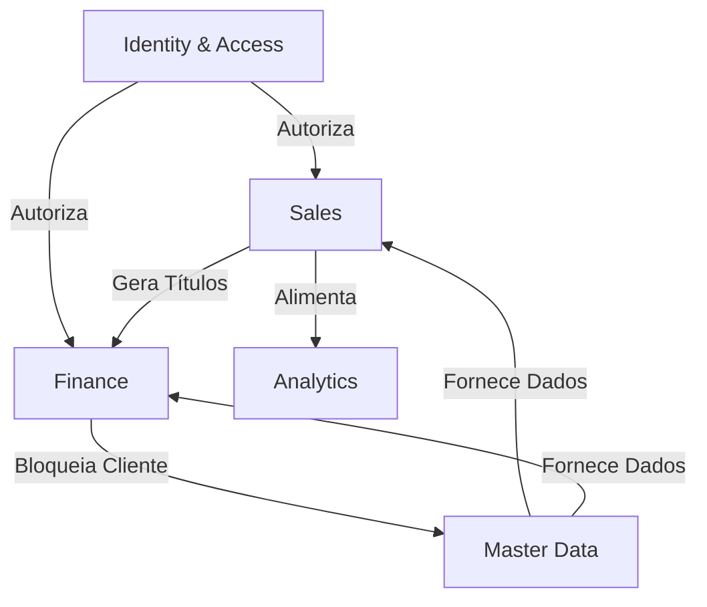

# Target Domain Model — Reversa

Este documento define o modelo de domínio para o sistema Reversa, estruturado em **Bounded Contexts**, **Aggregates**, **Entities** e **Domain Events**, seguindo o paradigma **Híbrido**.

## 1. Bounded Context: Identity & Access (Auth)
*Foco: Autenticação, Autorização e Gestão de Sessão.*

| Aggregate | Root Entity | Descrição |
| :--- | :--- | :--- |
| **UserAccount** | `User` | Credenciais, status, vínculo com unidade e perfil (RBAC). |
| **AccessPolicy** | `Permission` | Regras de acesso granulares (Módulos/Ações). |

### Eventos de Domínio
- `UserLoggedInEvent`: Disparado no login (atualiza `last_login`).
- `PasswordResetRequestedEvent`: Inicia fluxo de recuperação.

---

## 2. Bounded Context: Master Data
*Foco: Entidades mestre e cadastros base.*

| Aggregate | Root Entity | Descrição |
| :--- | :--- | :--- |
| **Customer** | `Cliente` | Dados fiscais, endereços, contatos e preferências. |
| **Product** | `Produto` | Catálogo de itens, categorias e regras de preço. |
| **Location** | `Unidade` | Cadastro de filiais/unidades de negócio. |

### Eventos de Domínio
- `CustomerCreatedEvent`: Notifica vendedor padrão.
- `CustomerStatusChangedEvent`: Disparado quando um cliente é bloqueado ('B').

---

## 3. Bounded Context: Sales (Commercial)
*Foco: Ciclo de vida da venda.*

| Aggregate | Root Entity | Descrição |
| :--- | :--- | :--- |
| **Quotation** | `Orcamento` | Proposta inicial, itens, descontos e validade. |
| **Order** | `Pedido` | Venda confirmada, itens finais e rastreio de faturamento. |

### Eventos de Domínio
- `QuotationConvertedEvent`: Quando um orçamento vira pedido.
- `OrderConfirmedEvent`: Inicia reserva de estoque/faturamento.

---

## 4. Bounded Context: Finance (Billing)
*Foco: Contas a receber e cobrança.*

| Aggregate | Root Entity | Descrição |
| :--- | :--- | :--- |
| **Receivable** | `Titulo` | Parcelas, vencimentos, juros e multas. |
| **Negotiation** | `Negociacao` | Agrupamento de títulos para acordo de pagamento. |

### Eventos de Domínio
- `PaymentReceivedEvent`: Baixa de título.
- `PaymentOverdueEvent`: Título entra em atraso (黄 - Destaque visual).
- `NegotiationClosedEvent`: Consolidação de acordo.

---

## 5. Bounded Context: Analytics (Performance)
*Foco: Metas e indicadores.*

| Aggregate | Root Entity | Descrição |
| :--- | :--- | :--- |
| **SalesPerformance** | `Meta` | Metas mensais, desdobramentos e atingimento. |
| **CustomerInsight** | `MVC` (View) | Cálculo de média de vendas e comportamento. |

### Eventos de Domínio
- `TargetReachedEvent`: Notificação de meta batida.
- `PerformanceAlertEvent`: Queda brusca no MVC.

---

## Relações de Domínio (Context Map)

