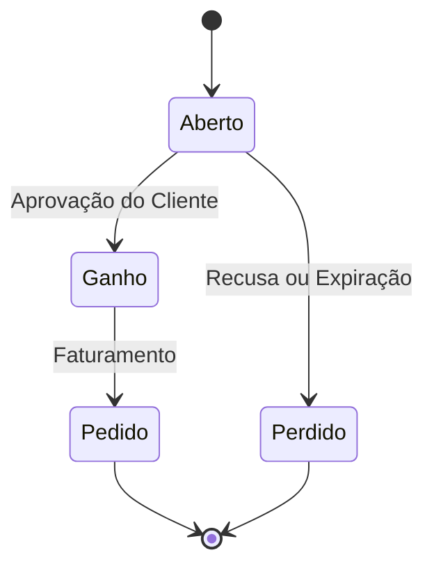
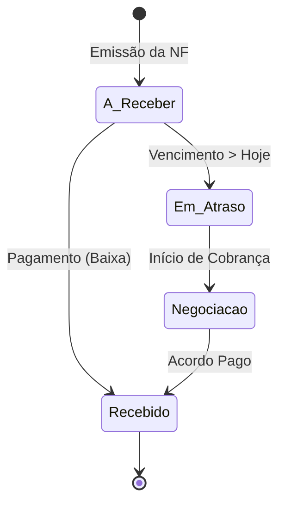
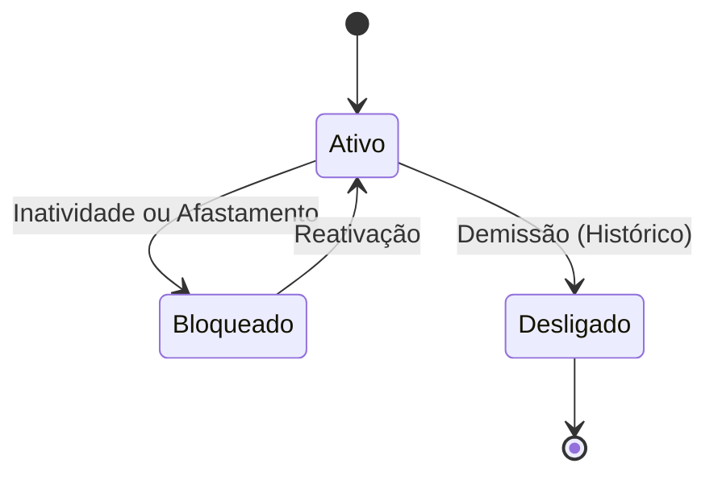

# Máquinas de Estado — rcg

O sistema gerencia o ciclo de vida de entidades críticas através de campos de status e tabelas de histórico.

## 1. Ciclo de Vida do Orçamento

O orçamento inicia sua jornada como uma proposta e pode ser ganho (virando pedido) ou perdido.

**Gatilhos:**
- **Ganho:** Acionado manualmente via `OrcamentoForm` ao mudar o status.
- **Pedido:** Conversão automática que gera o faturamento e gera o `pedido_id`.

## 2. Fluxo Financeiro (Título a Receber)

Os títulos transitam entre a emissão e a baixa efetiva, passando por cobrança se necessário.

**Regras de Transição:**
- **Negociação:** Ao entrar em negociação, os títulos são agrupados e o status da negociação vira 'G'.
- **Bloqueio:** O cliente pode ser movido para o status 'B' (Bloqueado) se possuir títulos em atraso (implícito na lógica de cobrança).

## 3. Status de Usuário e Vendedor

Controle de acesso e atividade operacional.

**Impacto:**
- **Bloqueado:** Impede o login ou oculta dados em dashboards analíticos.
- **Desligado:** Preserva os registros históricos de vendas e metas, mas remove o acesso e o dashboard.
