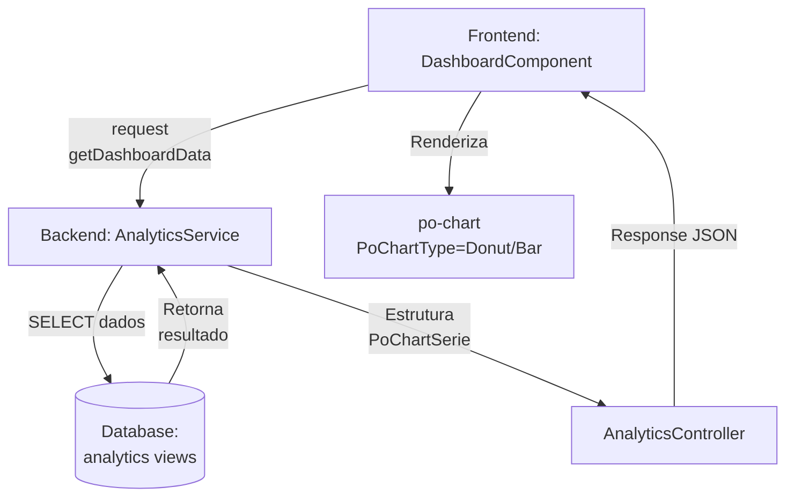

# Componentes de Gráfico — rcgCRM

Documentação completa dos componentes visuais de gráfico, estatísticas e visualização de dados utilizados nos diferentes layers da arquitetura.

## 📊 Visão Geral

O sistema utiliza **três stacks diferentes** para renderizar gráficos, de acordo com a camada:

| Camada | Framework | Componentes | Status |
|--------|-----------|-------------|--------|
| **Frontend (Angular)** | PO-UI | `po-chart`, `PoChartType`, `PoChartSerie` | 🟢 ATIVO |
| **Backend (Node.js)** | Chart.js | Renderização server-side (não-crítica) | 🟡 DISPONÍVEL |
| **Sistema Legado (PHP)** | Adianti BI | `BTableChart`, `BIndicator` | 🟢 LEGADO |

---

## 🎨 Frontend — PO-UI Chart Component

### Instalação & Setup

**Dependências:**
```json
{
  "@po-ui/ng-components": "^21.15.0",
  "@po-ui/ng-templates": "^21.15.0",
  "@po-ui/style": "^21.15.0"
}
```

**Imports (Angular):**
```typescript
import {
  PoModule,
  PoChartType,
  PoChartSerie,
} from '@po-ui/ng-components';

@NgModule({
  imports: [PoModule]
})
```

---

### Tipos de Gráficos (`PoChartType`)

| Tipo | Constante | Uso Recomendado | Exemplo |
|------|-----------|-----------------|---------|
| **Donut** | `PoChartType.Donut` | Proporcional, distribuição | Vendas por Categoria |
| **Pie** | `PoChartType.Pie` | Proporcional, parts of whole | Composição de vendas |
| **Bar** | `PoChartType.Bar` | Comparação horizontal | Top 5 Vendedores |
| **Column** | `PoChartType.Column` | Comparação vertical | Série temporal |
| **Line** | `PoChartType.Line` | Tendência temporal | Evolução mês a mês |
| **Area** | `PoChartType.Area` | Área preenchida | Acumulado com ênfase |

---

### Estrutura de Dados — `PoChartSerie`

```typescript
export interface PoChartSerie {
  label: string;           // Identificador/legenda
  data: number[];          // Array de valores
  color?: string;          // Cor HEX (#RRGGBB) — opcional
  type?: PoChartType;      // Sobrescreve tipo global
  tooltip?: string;        // Dica customizada
}
```

**Exemplo de dados estruturados:**
```typescript
categorySeries: Array<PoChartSerie> = [
  {
    label: "Vendas Diretas",
    data: [15000, 18000, 22000, 19500],
    color: "#0C8040"
  },
  {
    label: "Vendas Representante",
    data: [8000, 10000, 12000, 11000],
    color: "#006BA6"
  }
];
```

---

### Template HTML

```html
<po-widget p-title="Vendas por Categoria">
  <po-chart 
    [p-series]="categorySeries" 
    [p-type]="chartType"
    [p-height]="350"
    [p-options]="chartOptions">
  </po-chart>
</po-widget>
```

**Propriedades principais:**

| Propriedade | Tipo | Padrão | Descrição |
|-------------|------|--------|-----------|
| `p-series` | `PoChartSerie[]` | - | Array de séries de dados |
| `p-type` | `PoChartType` | `Column` | Tipo de gráfico |
| `p-height` | `number` | `300` | Altura em pixels |
| `p-options` | `object` | - | Opções avançadas (legend, tooltip, etc.) |

---

### Exemplo Real — Dashboard Analytics

**Componente (TypeScript):**
```typescript
import { Component, OnInit, inject } from '@angular/core';
import { PoChartType, PoChartSerie } from '@po-ui/ng-components';
import { AnalyticsService } from '../../../services/analytics';

@Component({
  selector: 'app-dashboard',
  templateUrl: './dashboard.html'
})
export class DashboardComponent implements OnInit {
  private analyticsService = inject(AnalyticsService);

  categorySeries: Array<PoChartSerie> = [];
  sellerSeries: Array<PoChartSerie> = [];
  
  chartType: PoChartType = PoChartType.Donut;        // Vendas por categoria
  barChartType: PoChartType = PoChartType.Bar;       // Top 5 Vendedores

  selectedYear: number = new Date().getFullYear();
  selectedMonth: number = new Date().getMonth() + 1;

  ngOnInit(): void {
    this.loadChartData();
  }

  loadChartData() {
    this.analyticsService.getDashboardData(this.selectedYear, this.selectedMonth)
      .subscribe({
        next: (res) => {
          this.categorySeries = res.categories;  // Estrutura: PoChartSerie[]
          this.sellerSeries = res.sellers;       // Estrutura: PoChartSerie[]
        },
        error: (err) => console.error("Erro ao carregar gráficos:", err)
      });
  }
}
```

**Dados esperados do backend:**
```json
{
  "summary": {
    "goal": 500000,
    "realized": 450000,
    "achievement": 90
  },
  "categories": [
    { "label": "Eletrônicos", "data": [45000, 52000, 48000, 51000] },
    { "label": "Móveis", "data": [28000, 31000, 29000, 32000] },
    { "label": "Outros", "data": [15000, 16000, 18000, 17000] }
  ],
  "sellers": [
    { "label": "João Silva", "data": [25000] },
    { "label": "Maria Santos", "data": [22000] },
    { "label": "Pedro Costa", "data": [20000] }
  ]
}
```

---

### Configurações Avançadas — `p-options`

```typescript
chartOptions = {
  legend: {
    show: true,
    position: 'bottom'  // top | bottom | left | right
  },
  tooltip: {
    show: true,
    format: 'R$ {value}'
  },
  grid: {
    show: true
  }
};

// No template:
// [p-options]="chartOptions"
```

---

## 📈 Backend — Chart.js (Renderização Server-Side)

> ⚠️ **Nota:** Chart.js está integrado mas não é utilizado para renderização crítica do dashboard atual. Considerado para **relatórios em PDF** ou **exportação de imagens**.

### Instalação

```bash
npm install --save nnnick/chartjs@^4.5
# ou
npm install --save chart.js @types/chart.js
```

### Uso Básico

```typescript
import Chart from 'chart.js/auto';

const ctx = document.getElementById('myChart') as HTMLCanvasElement;
const myChart = new Chart(ctx, {
  type: 'bar',
  data: {
    labels: ['Jan', 'Feb', 'Mar', 'Apr'],
    datasets: [
      {
        label: 'Vendas',
        data: [12000, 19000, 15000, 25000],
        backgroundColor: 'rgba(12, 128, 64, 0.7)',
        borderColor: 'rgb(12, 128, 64)',
        borderWidth: 1
      }
    ]
  },
  options: {
    responsive: true,
    maintainAspectRatio: true,
    scales: {
      y: {
        beginAtZero: true
      }
    }
  }
});
```

---

## 🧬 Sistema Legado — Adianti BI Components

### BTableChart

Componente tabular com capacidade de gráficos embutidos. Utilizado na **Gerência** e **Vendedor**.

**Classe PHP:**
```php
use Adianti\Database\TRecord;
use Adianti\Widget\Datagrid\TDataGrid;
use Adianti\Wrapper\BootstrapDatagridWrapper;
use Adianti\Database\Criteria;

class DashboardGerencia extends TPage {
  public function __construct() {
    parent::__construct();
    
    $grid = new TDataGrid;
    
    // Colunas com suporte a cálculos
    $grid->addColumn(new TDataGridColumn('categoria', 'Categoria', 'left', 200));
    $grid->addColumn(new TDataGridColumn('vendas', 'Vendas', 'right', 100));
    $grid->addColumn(new TDataGridColumn('meta', 'Meta', 'right', 100));
    $grid->addColumn(new TDataGridColumn('percentual', '%', 'center', 50));
  }
}
```

**Características:**
- ✅ Renderização no servidor
- ✅ Integrado com TRecord (ORM Adianti)
- ✅ Suporta estilos de linha condicional
- ⚠️ Não responsivo em mobile

---

### BIndicator

Componentes de KPI/Indicador para exibir valores-chave.

**Uso:**
```php
$indicator = new BIndicator;
$indicator->setValue(450000);
$indicator->setLabel("Vendas Realizadas");
$indicator->setIcon("an an-chart-line");
$indicator->setColor('#0C8040');
```

**Casos de uso:**
- Meta vs Realizado
- Taxa de crescimento
- Média de vendas por cliente

---

## 🎯 Fluxo de Dados — Dashboard Analytics



**Dados no fluxo:**

1. **Request:**
   ```
   GET /api/analytics/dashboard?year=2026&month=5
   ```

2. **Backend Query:**
   ```sql
   SELECT 
     categoria,
     SUM(vendas) as data
   FROM vendas_view
   WHERE ANO = 2026 AND MES = 5
   GROUP BY categoria
   ORDER BY data DESC;
   ```

3. **Response formatado:**
   ```json
   {
     "categories": [
       { "label": "Categoria A", "data": [100000] },
       { "label": "Categoria B", "data": [85000] }
     ]
   }
   ```

4. **Renderização:**
   - Mapeado para `PoChartSerie[]`
   - Vinculado ao `po-chart` component
   - Renderizado via Chart.js (interno do PO-UI)

---

## 🔧 Guia de Implementação

### Criar novo gráfico

**1. Definir interface de dados:**
```typescript
export interface ChartData {
  label: string;
  data: number[];
  color?: string;
}
```

**2. Adicionar ao serviço:**
```typescript
getMyChartData(): Observable<ChartData[]> {
  return this.http.get<ChartData[]>('/api/my-chart-data');
}
```

**3. Consumir no componente:**
```typescript
myChartSeries: PoChartSerie[] = [];
myChartType = PoChartType.Line;

ngOnInit() {
  this.analyticsService.getMyChartData().subscribe(
    data => this.myChartSeries = data
  );
}
```

**4. Render no template:**
```html
<po-widget p-title="Meu Gráfico">
  <po-chart 
    [p-series]="myChartSeries"
    [p-type]="myChartType"
    [p-height]="350">
  </po-chart>
</po-widget>
```

---

## 📋 Checklist de Validação

- [ ] Dados estruturados como `PoChartSerie[]`
- [ ] Tipo de gráfico (`PoChartType`) apropriado para dados
- [ ] Cores definidas e consistentes com paleta (Ver: [design.md](../gerencia/design.md))
- [ ] Height definido (recomendado: 300–400px)
- [ ] Tooltip customizado (se necessário)
- [ ] Legend visível e inteligível
- [ ] Performance: máx. 5–10 séries por gráfico
- [ ] Responsividade testada em mobile
- [ ] Nenhum console.error relacionado ao gráfico

---

## 🚨 Limitações Conhecidas

| Limite | Valor | Implicação |
|--------|-------|-----------|
| **Máx. séries por gráfico** | 10 | Acima disso, o gráfico fica poluído |
| **Máx. pontos por série** | 100 | Performance degrada em line charts |
| **Tamanho mínimo de widget** | `po-md-6` | Em screens pequenas, fica ilegível |
| **Cores suportadas** | HEX válido | RGB/RGBA podem não renderizar |

---

## 📚 Referências Externas

- [PO-UI Chart Documentation](https://po-ui.io/ng/components/po-chart)
- [Chart.js Official Docs](https://www.chartjs.org/)
- [Adianti Framework BI](https://framework.adianti.com.br/)

---

## 📝 Status de Documentação

- ✅ **Frontend Components**: Documentado em detalhes
- ✅ **Data Flow**: Mapeado com exemplos
- ✅ **Legacy System**: Referenciado
- ⚠️ **Performance Tuning**: Pending deep analysis
- ⚠️ **Chart.js Integration**: Não utilizado em produção atualmente

---

**Última atualização:** Maio 2026  
**Versões documentadas:** PO-UI 21.15, Angular 21, Chart.js 4.5
