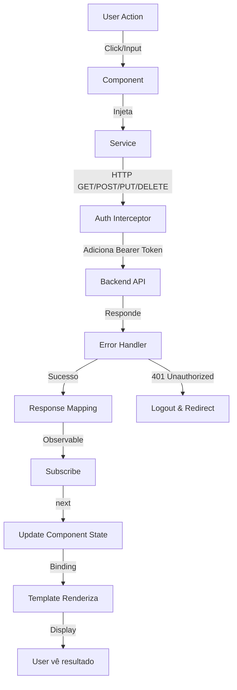

# Arquitetura Frontend — rcgCRM

Documentação completa da arquitetura Angular, padrões, serviços, diretivas, interceptadores e modelos de dados.

## 📐 Estrutura Geral

```
frontend/src/app/
├── app.component.ts          # Root component
├── app.config.ts             # Configuração global (providers, etc)
├── app.routes.ts             # Roteamento
├── guards/                   # Route guards
├── interceptors/             # HTTP interceptors
├── services/                 # Serviços (data layer)
└── pages/                    # Componentes de tela (feature modules)
    ├── admin/                # Admin pages
    ├── analytics/            # Analytics dashboard
    ├── billing/              # Cobrança
    ├── catalog/              # Catálogo
    ├── commercial/           # Comercial
    ├── finance/              # Financeiro
    ├── home/                 # Home/Menu
    └── login/                # Autenticação
```

**Paradigma:** Standalone components (Angular 14+)

---

## 🔧 Serviços (Data Layer)

### Padrão Geral

```typescript
import { Injectable } from '@angular/core';
import { HttpClient, HttpHeaders, HttpParams } from '@angular/common/http';
import { Observable } from 'rxjs';
import { environment } from '../../environments/environment';

@Injectable({
  providedIn: 'root'  // Singleton, injetável globalmente
})
export class MyService {
  private readonly API_URL = `${environment.apiUrl}/my-resource`;

  constructor(private http: HttpClient) { }

  private getHeaders() {
    const token = localStorage.getItem('token');
    return new HttpHeaders().set('Authorization', `Bearer ${token}`);
  }

  // REST CRUD
  findAll(page: number = 1, limit: number = 10): Observable<any> {
    const params = new HttpParams()
      .set('page', page.toString())
      .set('limit', limit.toString());
    return this.http.get<any>(this.API_URL, { 
      headers: this.getHeaders(),
      params: params
    });
  }

  findOne(id: number): Observable<any> {
    return this.http.get<any>(`${this.API_URL}/${id}`, { 
      headers: this.getHeaders() 
    });
  }

  save(data: any): Observable<any> {
    if (data.id) {
      return this.http.put<any>(`${this.API_URL}/${data.id}`, data, { 
        headers: this.getHeaders() 
      });
    }
    return this.http.post<any>(this.API_URL, data, { 
      headers: this.getHeaders() 
    });
  }

  delete(id: number): Observable<any> {
    return this.http.delete<any>(`${this.API_URL}/${id}`, { 
      headers: this.getHeaders() 
    });
  }
}
```

### Serviços Documentados

| Serviço | Arquivo | Responsabilidade | Endpoints |
|---------|---------|------------------|-----------|
| **AuthService** | [services/auth.ts](../../services/auth.ts) | Autenticação, login, 2FA, termos | `/auth/login`, `/auth/verify-2fa`, `/auth/accept-terms` |
| **AnalyticsService** | [services/analytics.ts](../../services/analytics.ts) | Dashboard KPIs, gráficos, MVC | `/analytics/dashboard`, `/analytics/mvc` |
| **VendedorService** | [services/vendedor.ts](../../services/vendedor.ts) | CRUD de vendedores | `/commercial/vendedores` |
| **ClienteService** | [services/cliente.ts](../../services/cliente.ts) | CRUD de clientes | `/clientes` |
| **MetaVendedorService** | [services/meta-vendedor.ts](../../services/meta-vendedor.ts) | Metas e objetivos | `/gerencia/metas` |
| **BillingService** | [services/billing.ts](../../services/billing.ts) | Cobrança | `/finance/billing` |
| **ProductService** | [services/product.ts](../../services/product.ts) | Catálogo de produtos | `/catalog/products` |

### Padrão de Resposta da API

```typescript
// Resposta paginada
{
  "items": [...],           // Array de recursos
  "total": 100,             // Total de registros
  "page": 1,
  "limit": 10,
  "totalPages": 10
}

// Resposta singular
{
  "id": 1,
  "nome": "João",
  "email": "joao@example.com"
  // ...
}
```

---

## 🛡️ Interceptadores (HTTP Layer)

### Auth Interceptor

**Arquivo:** [interceptors/auth.interceptor.ts](../../interceptors/auth.interceptor.ts)

```typescript
import { HttpInterceptorFn, HttpErrorResponse } from '@angular/common/http';
import { inject } from '@angular/core';
import { Router } from '@angular/router';
import { catchError, throwError } from 'rxjs';
import { AuthService } from '../services/auth';

export const authInterceptor: HttpInterceptorFn = (req, next) => {
  const authService = inject(AuthService);
  const router = inject(Router);

  // Adiciona token ao header Authorization
  const token = localStorage.getItem('token');
  let authReq = req;

  if (token) {
    authReq = req.clone({
      setHeaders: {
        Authorization: `Bearer ${token}`
      }
    });
  }

  return next(authReq).pipe(
    catchError((error: any) => {
      // Handle 401 Unauthorized
      if (error instanceof HttpErrorResponse && error.status === 401) {
        authService.logout();
        router.navigate(['/login'], { queryParams: { error: 'session' } });
      }
      return throwError(() => error);
    })
  );
};
```

**Responsabilidades:**
- ✅ Adiciona `Authorization: Bearer <token>` a todos os requests
- ✅ Captura 401 (Unauthorized) e redireciona para login
- ✅ Limpa sessão ao expirar

**Registro global:**
```typescript
// app.config.ts
import { HTTP_INTERCEPTORS } from '@angular/common/http';

export const appConfig: ApplicationConfig = {
  providers: [
    {
      provide: HTTP_INTERCEPTORS,
      useValue: authInterceptor,
      multi: true
    }
  ]
};
```

---

## 🚦 Route Guards

**Padrão:** CanActivate, CanDeactivate

### Exemplo: AuthGuard

```typescript
import { Injectable } from '@angular/core';
import { CanActivateFn, Router } from '@angular/router';
import { AuthService } from '../services/auth';

export const authGuard: CanActivateFn = (route, state) => {
  const authService = inject(AuthService);
  const router = inject(Router);

  const user = authService.getUser();
  
  if (user && user.id) {
    return true;  // Permite acesso
  }
  
  router.navigate(['/login'], { 
    queryParams: { returnUrl: state.url } 
  });
  return false;  // Nega acesso
};
```

**Uso em rotas:**
```typescript
// app.routes.ts
export const routes: Routes = [
  {
    path: 'dashboard',
    component: DashboardComponent,
    canActivate: [authGuard]
  }
];
```

---

## 📦 Modelos & Interfaces

### Status Atual: ⚠️ Não Tipados Fortemente

**Problema:** Serviços usam `any` em lugar de interfaces específicas.

```typescript
// ❌ ANTES (atual)
getDashboardData(year?: number, month?: number): Observable<any> {
  // ...
  return this.http.get<any>(`${this.API_URL}/dashboard`, { ... });
}

// ✅ DEPOIS (recomendado)
getDashboardData(year?: number, month?: number): Observable<DashboardData> {
  return this.http.get<DashboardData>(`${this.API_URL}/dashboard`, { ... });
}
```

### Interfaces Sugeridas

**Dashboard:**
```typescript
export interface DashboardData {
  summary: {
    goal: number;
    realized: number;
    achievement: number;
  };
  categories: PoChartSerie[];
  sellers: PoChartSerie[];
}

export interface DashboardParams {
  year: number;
  month: number;
  vendedorId?: number;
}
```

**MVC (Média de Venda do Cliente):**
```typescript
export interface MvcItem {
  cliente_id: number;
  cliente_nome: string;
  codigo: string;
  municipio_descricao: string;
  financeiro_status: 'R' | 'B';  // Atrasado | Em dia
  situacao: 'A' | 'B';           // Ativo | Bloqueado
  difference: number;
  venda_mes: number;
  average3Months: number;
  dias: number;
}
```

**Vendedor:**
```typescript
export interface Vendedor {
  id: number;
  nome: string;
  email: string;
  status: 'A' | 'I';
  dashboard: 'S' | 'N';
  // ...
}
```

**User/Auth:**
```typescript
export interface User {
  id: number;
  username: string;
  email: string;
  perfil: 'admin' | 'supervisor' | 'vendedor' | 'cliente';
  isGerente?: boolean;
  supervisorId?: number;
  // ...
}

export interface AuthResponse {
  accessToken: string;
  refreshToken?: string;
  user: User;
  nextStep?: 'verify-2fa' | 'accept-terms';
}
```

---

## 🎨 Componentes de Tela (Pages)

### Arquitetura por Página

```typescript
import { Component, OnInit, ViewChild, inject } from '@angular/core';
import { CommonModule } from '@angular/common';
import { FormsModule } from '@angular/forms';
import { Router } from '@angular/router';
import { PoModule, PoNotificationService } from '@po-ui/ng-components';
import { MyService } from '../../../services/my.service';

@Component({
  selector: 'app-my-page',
  standalone: true,
  imports: [CommonModule, PoModule, FormsModule],
  templateUrl: './my-page.html',
  styleUrls: ['./my-page.css']
})
export class MyPageComponent implements OnInit {
  
  // ===== Dependency Injection (Functional)
  private myService = inject(MyService);
  private notificationService = inject(PoNotificationService);
  private router = inject(Router);

  // ===== State
  isLoading: boolean = false;
  items: any[] = [];
  selectedItem: any = null;
  
  // ===== Filters
  selectedYear: number = new Date().getFullYear();
  selectedMonth: number = new Date().getMonth() + 1;

  // ===== UI Configuration
  readonly pageActions = [
    { label: 'Novo', action: this.new.bind(this), icon: 'po-icon-plus' },
    { label: 'Atualizar', action: this.reload.bind(this), icon: 'po-icon-refresh' }
  ];

  readonly columns = [
    { property: 'id', label: 'ID', width: '80px' },
    { property: 'nome', label: 'Nome', width: '200px' },
    // ...
  ];

  readonly tableActions = [
    { label: 'Editar', action: (item: any) => this.edit(item), icon: 'po-icon-edit' },
    { label: 'Deletar', action: (item: any) => this.delete(item), icon: 'po-icon-delete' }
  ];

  // ===== View References
  @ViewChild('myModal') myModal: any;

  ngOnInit(): void {
    this.loadData();
  }

  loadData(): void {
    this.isLoading = true;
    this.myService.findAll(1, 10).subscribe({
      next: (response) => {
        this.items = response.items;
        this.isLoading = false;
      },
      error: (err) => {
        console.error('Erro ao carregar dados:', err);
        this.notificationService.error('Falha ao carregar dados');
        this.isLoading = false;
      }
    });
  }

  new(): void {
    this.selectedItem = {};
    this.myModal.open();
  }

  edit(item: any): void {
    this.selectedItem = { ...item };
    this.myModal.open();
  }

  save(): void {
    this.myService.save(this.selectedItem).subscribe({
      next: () => {
        this.notificationService.success('Salvo com sucesso');
        this.myModal.close();
        this.loadData();
      },
      error: (err) => this.notificationService.error('Erro ao salvar')
    });
  }

  delete(item: any): void {
    if (confirm('Tem certeza?')) {
      this.myService.delete(item.id).subscribe({
        next: () => {
          this.notificationService.success('Deletado com sucesso');
          this.loadData();
        },
        error: (err) => this.notificationService.error('Erro ao deletar')
      });
    }
  }

  reload(): void {
    this.loadData();
  }
}
```

### Template Padrão

```html
<po-page 
  [p-title]="'Minha Página'" 
  [p-actions]="pageActions">

  <!-- Filtros -->
  <po-widget>
    <div class="po-row">
      <po-select 
        class="po-md-6"
        [p-options]="yearsOptions"
        [(ngModel)]="selectedYear"
        p-label="Ano"
        (p-change)="loadData()">
      </po-select>
      <po-select 
        class="po-md-6"
        [p-options]="monthsOptions"
        [(ngModel)]="selectedMonth"
        p-label="Mês"
        (p-change)="loadData()">
      </po-select>
    </div>
  </po-widget>

  <!-- Tabela -->
  <po-table
    [p-columns]="columns"
    [p-items]="items"
    [p-actions]="tableActions"
    [p-loading]="isLoading">
  </po-table>

  <!-- Modal de Edição -->
  <po-modal 
    #myModal
    p-title="Editar Item"
    p-primary-action="Salvar"
    p-primary-label="Salvar"
    (p-primary-action)="save()">
    
    <po-input 
      [(ngModel)]="selectedItem.nome"
      p-label="Nome"
      p-required="true">
    </po-input>
    
  </po-modal>

</po-page>
```

### Páginas Documentadas

| Página | Arquivo | Descrição |
|--------|---------|-----------|
| **Dashboard Analytics** | [pages/analytics/dashboard/](../../../pages/analytics/dashboard/) | KPIs, gráficos, MVC |
| **Login** | [pages/login/](../../../pages/login/) | Autenticação, 2FA, Termos |
| **Home** | [pages/home/](../../../pages/home/) | Menu principal |
| **Admin** | [pages/admin/](../../../pages/admin/) | CRUD administrativo |

---

## 🔌 Diretivas Customizadas

### Status: ⚠️ Não Implementadas

Recomendações para adicionar:

**Diretiva de Permissão:**
```typescript
import { Directive, Input, TemplateRef, ViewContainerRef, OnInit, inject } from '@angular/core';
import { AuthService } from '../services/auth';

@Directive({
  selector: '[appHasPermission]',
  standalone: true
})
export class HasPermissionDirective implements OnInit {
  @Input() appHasPermission!: string;

  private templateRef = inject(TemplateRef<any>);
  private viewContainer = inject(ViewContainerRef);
  private authService = inject(AuthService);

  ngOnInit() {
    const user = this.authService.getUser();
    const hasPermission = user?.permissoes?.includes(this.appHasPermission);

    if (hasPermission) {
      this.viewContainer.createEmbeddedView(this.templateRef);
    } else {
      this.viewContainer.clear();
    }
  }
}
```

**Uso:**
```html
<button *appHasPermission="'admin.delete'">Deletar</button>
```

---

## 📊 Fluxo de Dados Completo



---

## ⚙️ Configuração Global (app.config.ts)

```typescript
import { ApplicationConfig, importProvidersFrom } from '@angular/core';
import { provideRouter, withInMemoryScrolling } from '@angular/router';
import { provideHttpClient, withInterceptors, HTTP_INTERCEPTORS } from '@angular/common/http';
import { provideAnimations } from '@angular/platform-browser/animations';
import { PoModule } from '@po-ui/ng-components';

import { routes } from './app.routes';
import { authInterceptor } from './interceptors/auth.interceptor';

export const appConfig: ApplicationConfig = {
  providers: [
    provideRouter(routes, withInMemoryScrolling({ scrollPositionRestoration: 'top' })),
    provideHttpClient(withInterceptors([authInterceptor])),
    provideAnimations(),
    importProvidersFrom(PoModule)
  ]
};
```

---

## 🗺️ Roteamento (app.routes.ts)

```typescript
import { Routes } from '@angular/router';
import { authGuard } from './guards/auth.guard';

export const routes: Routes = [
  {
    path: '',
    redirectTo: 'home',
    pathMatch: 'full'
  },
  {
    path: 'login',
    loadComponent: () => import('./pages/login/login').then(m => m.LoginComponent)
  },
  {
    path: 'home',
    loadComponent: () => import('./pages/home/home').then(m => m.HomeComponent),
    canActivate: [authGuard]
  },
  {
    path: 'admin',
    loadComponent: () => import('./pages/admin/admin').then(m => m.AdminComponent),
    canActivate: [authGuard]
  },
  {
    path: 'analytics',
    loadComponent: () => import('./pages/analytics/dashboard/dashboard').then(m => m.DashboardComponent),
    canActivate: [authGuard]
  }
];
```

---

## ✅ Checklist de Implementação

### Serviços
- [x] AuthService
- [x] AnalyticsService
- [x] VendedorService
- [x] ClienteService
- [x] MetaVendedorService
- [ ] Tipagem forte com interfaces

### Interceptadores
- [x] Auth Interceptor (Bearer Token)
- [ ] Error Handler Interceptor (centralizado)
- [ ] Logging Interceptor (debug)
- [ ] Cache Interceptor

### Guards
- [x] Auth Guard
- [ ] Role-Based Access Control (RBAC)
- [ ] Unsaved Changes Guard

### Diretivas
- [ ] Has Permission
- [ ] Loading Spinner
- [ ] Error Display
- [ ] Debounce Click

### Componentes
- [x] Dashboard Analytics
- [x] Login
- [x] Home
- [ ] Generic CRUD Form
- [ ] Generic Data Table

---

## 🚨 Problemas Conhecidos

| Problema | Status | Solução |
|----------|--------|---------|
| Sem tipagem forte (`any` everywhere) | ⚠️ CRÍTICO | Criar interfaces em `models/` folder |
| Sem tratamento centralizado de erros | ⚠️ IMPORTANTE | Implementar Error Interceptor |
| Sem cache de requisições | 🟡 NICE-TO-HAVE | Implementar Cache Interceptor |
| Sem testes unitários | ⚠️ IMPORTANTE | Adicionar testes para serviços |
| Sem gestão de estado global | 🟡 NICE-TO-HAVE | Considerar NgRx ou Akita se crescer |

---

## 📚 Referências Externas

- [Angular Documentation](https://angular.io)
- [PO-UI Components](https://po-ui.io/ng/components)
- [RxJS Documentation](https://rxjs.dev/)
- [HTTP Client Guide](https://angular.io/guide/http)

---

**Última atualização:** Maio 2026  
**Versões:** Angular 21, PO-UI 21.15, RxJS 7.8
