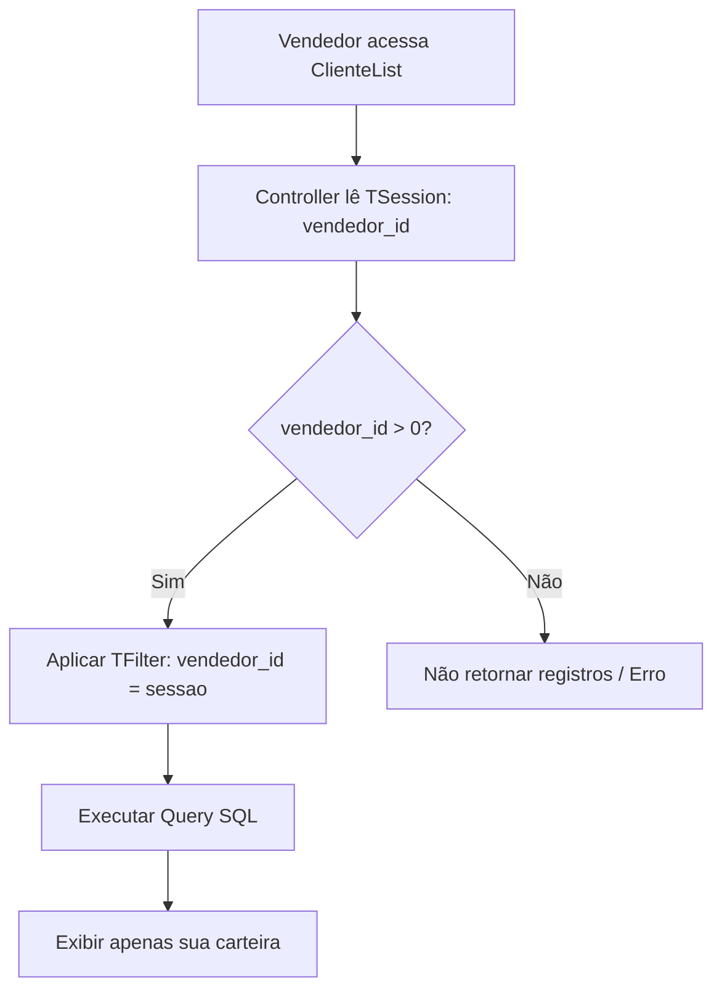

# Vendedor — Fluxos Detalhados

## 1. Fluxo de Isolamento de Dados (Escopo Individual)

Garante a privacidade comercial entre representantes.

## 2. Fluxo de Cálculo de Performance (Dashboard)

1. **Gatilho:** Abertura da Frontpage do Vendedor.
2. **Consultas em Paralelo (SQL):**
    - `SUM(vlr_liquido) FROM ViewVendedorVendaMes` onde `vendedor_id = X`.
    - `COUNT(DISTINCT cliente_id) FROM ViewBaseClienteMes` (Positivação).
    - `SUM(vlr_objetivo) FROM meta_vendedor_mes` (Meta do Mês).
3. **Lógica de Interface:**
    - Se meta > 0: `progresso = (vendas / meta) * 100`.
    - Senão: `progresso = 0`.
4. **Output:** Renderização da barra de progresso e indicadores de cor (Verde se >= 100%, Amarelo se >= 80%, Vermelho se < 80%). 🟡

## 3. Fluxo de Agenda CRM

1. **Ação:** Vendedor clica em "Agendar Visita" na ficha do cliente.
2. **Preenchimento:** O sistema carrega o `AtendimentoCalendarForm` já com o `cliente_id` fixado. 🟢
3. **Validação:** Exige preenchimento de `horario_inicial`, `horario_final` e um breve texto de `titulo`.
4. **Persistência:** Grava em `atendimento` e exibe o evento no calendário pessoal do vendedor. 🟢
